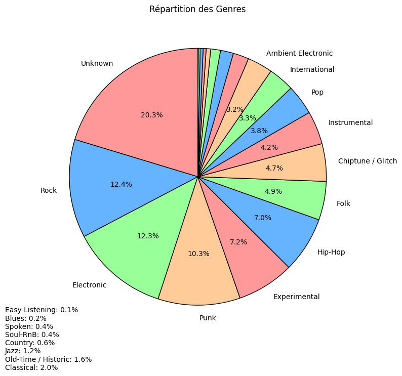

# Song-Classification
Ceci est un repositoire pour le projet du module Interactions Homme-Machine (M2 VMI- FI) qui consiste en la classification d'une chanson selon son genre musical.
### Participants: 
 - Malek BENNABI
 - Gabriel LUCCHINI
 - Nicolas PLUVEN

## Dataset utilisé:
 lewtun/music genres (25k audio files) - [Hugging face](https://huggingface.co/datasets/lewtun/music_genres)

 Le Dataset a été réarrangé dans le format Kaggle et est disponible à l'adresse suivante: [Music_Genres](https://www.kaggle.com/datasets/malekbennabi/music-genres)*

 # 

## Pré-traitement:

## Etapes de la réalisation du projet:
* Transformation du dataset audio en données Mel spectrogrammes (données visuelles)
* Préparation des images obtenues en les redimensionnant
* Classification avec CNN (VGG16 et EfficientNet)
* Classification avec Transformer (ViTb16)
* Exportation des modèles entrainés et prediction sur de nouvelles données en top-1, top-3 et top-5

## Résultats:

1- SVM: 

2- CNN:
  * CNN from scratch: 
  * CNN EfficientNet: 
    
3- Transformer:

## Présentation .pptx disponible à l'adresse: [Presentation_IHM](https://github.com/Malekbennabi3/Song-Classification/blob/main/Projet_IHM.pptx%20(1).pdf)
